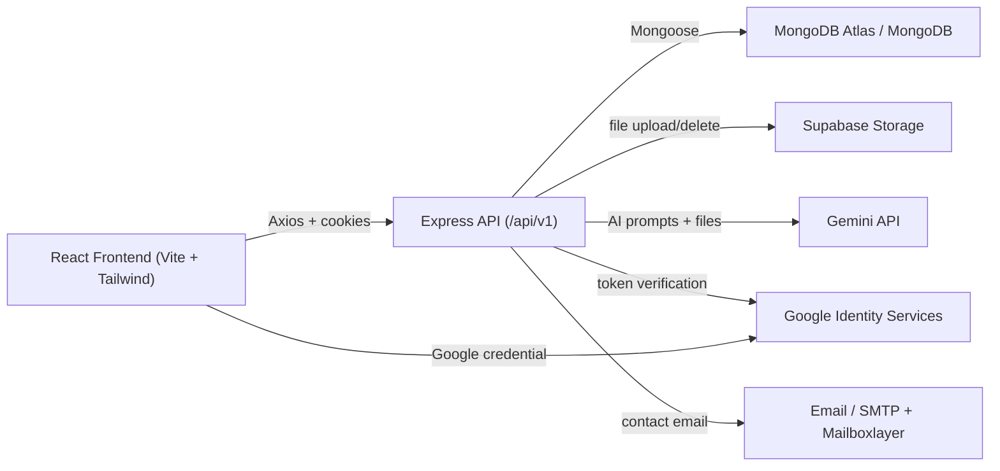

# GBPIET Notes

GBPIET Notes is a full-stack college community platform for students, CRs, faculty, and admins to share academic resources, ask and answer doubts, follow contributors, track activity, and use an AI study assistant for notes, PDFs, images, handwritten material, and direct questions.

The project is built as a MERN-style application with a React + Tailwind frontend, an Express + MongoDB backend, Supabase Storage for uploaded files, Google authentication, and Gemini-powered AI assistance.

This README documents the current project state, technology stack, architecture, routes, features, services, environment variables, known gaps, and future work.

## Project Status

The application is in an active development phase. Many major flows are implemented and connected to backend APIs:

- Authentication with email/password and Google Sign-In.
- Profile completion after signup.
- Notes upload, listing, detail view, comments, upvotes, open PDF, and download PDF.
- Q&A with question upload, optional images, tags, answer upload, optional answer images, likes, and liked-user lists.
- Community posts with text/image posts, likes, comments, edit/delete, and user suggestions.
- User directory with follow buttons.
- Student profile pages with stats, cover image, bio, tech stack, interests, profile links, notes, Q&A, and posts.
- Leaderboard and activity dashboard with weekly, monthly, and yearly contribution views.
- AI chatbot page with streaming responses, uploaded files, local chat history, vector-style retrieval over project content, and reference links.
- Landing page for logged-out users with real backend data for stats, contributors, top notes, and activity.

Some areas are functional but still need UI polish, validation, or deeper product hardening. See [Known Gaps And Pending Work](#known-gaps-and-pending-work).

## Repository Structure

```text
GBPIET_NOTE/
  backend/
    src/
      app.js
      index.js
      constant.js
      controllers/
      db/
      middlewares/
      models/
      routes/
      utils/
    package.json
    package-lock.json
  frontend/
    public/
    src/
      assets/
      components/
      context/
      pages/
      services/
      utils/
      App.jsx
      index.css
      main.jsx
    package.json
    package-lock.json
    tailwind.config.js
    vite.config.js
    vercel.json
  Readme.MD
```

## High-Level Architecture



## Tech Stack

### Frontend

- React `^19.2.0`
- React DOM `^19.2.0`
- React Router DOM `^7.10.1`
- Vite `^7.2.4`
- Tailwind CSS `^3.4.18`
- Axios `^1.13.4`
- Lucide React `^0.577.0`
- Framer Motion `^12.29.2`
- ESLint `^9.39.1`
- PostCSS `^8.5.6`
- Autoprefixer `^10.4.22`

### Backend

- Node.js with native ES modules
- Express `^5.1.0`
- MongoDB driver `^6.21.0`
- Mongoose `^8.19.2`
- JWT authentication with `jsonwebtoken ^9.0.2`
- Password hashing with `bcrypt ^6.0.0`
- Cookie parsing with `cookie-parser ^1.4.7`
- CORS with `cors ^2.8.5`
- Environment variables with `dotenv ^17.2.3`
- File handling with `multer ^2.0.2`
- Supabase JS client `^2.76.1`
- Axios `^1.13.2`
- Nodemailer `^8.0.3`
- MIME detection with `mime-types ^3.0.1`
- Morgan `^1.10.1`
- PostgreSQL driver `pg ^8.16.3` is installed, although the current backend persistence is MongoDB/Mongoose.
- Nodemon `^3.1.10` for development

### External Services

- MongoDB for database storage.
- Supabase Storage for uploaded files.
- Google OAuth / Google Identity Services for Google login/signup.
- Gemini API for AI chatbot responses.
- Optional Google Search grounding through Gemini tools.
- Mailboxlayer for email validation.
- SMTP email service through Nodemailer for contact form delivery.
- Vercel configuration exists for frontend deployment.

## Frontend Application Map

### App Routing

Frontend routes are defined in `frontend/src/App.jsx`.

Public/auth routes:

- `/login` - login page.
- `/signup` - signup page.
- `/complete-profile` - protected profile completion flow after first signup.

Main layout routes:

- `/` - logged-out landing page or authenticated dashboard.
- `/notes` - notes/resources page.
- `/notes/:noteId` - note detail page.
- `/posts` - community page.
- `/questions` - Q&A page.
- `/ai-chatbot` - independent AI chatbot page.
- `/leaderboard` - leaderboard and activity dashboard.
- `/users` - user directory.
- `/profile/:username` - public student profile page.
- `/settings` - user settings.
- `/contact` - contact page.
- `/about` - about page.

Most app pages are wrapped by `Layout`, which renders the sticky top header and footer. The logged-out landing page intentionally skips the header/sidebar-style layout.

### Shared Frontend Systems

- `frontend/src/services/api.js`
  - Central Axios instance.
  - Uses `VITE_API_BASE_URL`.
  - Sends cookies with `withCredentials: true`.

- `frontend/src/context/AuthContext.jsx`
  - Loads current user from `/users/current-user`.
  - Stores authenticated user state.
  - Provides `login`, `logout`, and `setUser`.

- `frontend/src/components/common/ProtectedRoute.jsx`
  - Redirects unauthenticated users to `/login`.
  - Redirects incomplete profiles to `/complete-profile`.

- `frontend/src/components/common/Header.jsx`
  - Sticky top navbar.
  - Desktop horizontal nav.
  - Mobile hamburger slide-out menu.
  - Profile dropdown through `PrfileDropdown.jsx`.

- `frontend/src/index.css`
  - Global Tailwind layers.
  - Shared design utilities:
    - `.app-page`
    - `.app-shell`
    - `.glass-panel`
    - `.soft-card`
    - `.app-input`
    - `.app-button`
    - `.app-button-secondary`
    - `.pill`
    - `.page-title`
    - `.page-subtitle`
    - `.responsive-panel`

## Backend Application Map

### Server Entry

- `backend/src/index.js`
  - Loads `.env`.
  - Connects MongoDB.
  - Starts Express on `PORT` or `8000`.

- `backend/src/app.js`
  - Configures CORS.
  - Enables cookies.
  - Parses JSON and URL-encoded payloads.
  - Sets `Cross-Origin-Opener-Policy: same-origin-allow-popups` for Google popup compatibility.
  - Registers API route groups under `/api/v1`.
  - Registers centralized error handler.

### API Route Groups

Base API path is:

```text
/api/v1
```

Mounted route groups:

- `/users`
- `/notes`
- `/upvotes`
- `/follows`
- `/questions`
- `/answers`
- `/posts`
- `/contact`
- `/activity`
- `/ai-chat`

## Data Models

### User

Model file: `backend/src/models/user.model.js`

Fields:

- `username`
- `email`
- `googleId`
- `fullName`
- `password`
- `avatar`
- `coverImage`
- `role`
  - `student`
  - `cr`
  - `faculty`
  - `admin`
- `branch`
- `year`
- `bio`
- `techStack`
- `interests`
- `profileLinks`
  - `github`
  - `linkedin`
  - `portfolio`
  - `instagram`
- `credits`
- `upvotes`
- `refreshToken`
- `profileCompleted`
- timestamps

Model behavior:

- Password is hashed before save.
- Access token generation is available on user instances.
- Refresh token generation is available on user instances.

### Note

Model file: `backend/src/models/note.model.js`

Fields:

- `title`
- `description`
- `fileUrl`
- `uploadedBy`
- `originalStudent`
- `upvotes`
- `comments`
- `verified`
- `subjectName`
- `subjectCode`
- `type`
  - `notes`
  - `pyqs`
  - `tuts`
  - `assignments`
- `tags`
- timestamps

### Question

Model file: `backend/src/models/question.model.js`

Fields:

- `title`
- `description`
- `imageUrl`
- `subjectName`
- `subjectCode`
- `tags`
- `askedBy`
- `upvotes`
- `answers`
- timestamps

### Answer

Model file: `backend/src/models/answer.model.js`

Fields:

- `content`
- `imageUrl`
- `answeredBy`
- `question`
- `upvotes`
- `comments`
- timestamps

### Post

Model file: `backend/src/models/post.model.js`

Fields:

- `text`
- `imageUrl`
- `postedBy`
- `upvotes`
- `comments`
- timestamps

Validation:

- A post must contain text, image, or both.

### Upvote

Model file: `backend/src/models/upvote.model.js`

Fields:

- `note`
- `question`
- `answer`
- `post`
- `upvotedBy`
- timestamps

This generic model supports likes/upvotes across notes, questions, answers, and posts.

### Follow

Model file: `backend/src/models/follow.model.js`

Fields:

- `follower`
- `following`
- timestamps

Indexes:

- Unique compound index on `{ follower, following }` prevents duplicate follow records.

## Authentication And User Flow

### Email/Password Signup

Endpoint:

```text
POST /api/v1/users/register
```

Frontend:

- `frontend/src/pages/common/SignupPage.jsx`

Current behavior:

- User provides email and password.
- Backend validates real email using `verifyRealEmail`.
- Username is generated from email.
- User is created with:
  - `branch: "Unassigned"`
  - `role: "student"`
  - `profileCompleted: false`
- Access and refresh cookies are set.
- User is redirected to profile completion if profile is incomplete.

### Login

Endpoint:

```text
POST /api/v1/users/login
```

Frontend:

- `frontend/src/pages/common/LoginPage.jsx`

Current behavior:

- Supports email or username plus password.
- Sets auth cookies on success.
- Loads authenticated user into context.

### Google Auth

Endpoint:

```text
POST /api/v1/users/google
```

Frontend:

- `frontend/src/components/common/GoogleAuthButton.jsx`
- `frontend/src/pages/common/LoginPage.jsx`
- `frontend/src/pages/common/SignupPage.jsx`

Current behavior:

- Frontend receives Google credential.
- Backend verifies token using Google tokeninfo endpoint.
- Backend validates token audience using `GOOGLE_CLIENT_ID`.
- Existing user is linked by email or `googleId`.
- New Google user is created with a generated username and incomplete profile.

### Complete Profile

Endpoint:

```text
PATCH /api/v1/users/complete-profile
```

Frontend:

- `frontend/src/pages/common/CompleteProfilePage.jsx`

Fields:

- Full name
- Username
- Branch
- Year
- Role/user type

Current note:

- The UI currently exposes role choices including admin. Backend prevents multiple admins, but this flow should be tightened before production.

### Logout

Endpoint:

```text
POST /api/v1/users/logout
```

Current behavior:

- Clears stored refresh token.
- Clears access and refresh cookies.
- Clears frontend auth state.

## Notes / Resources Feature

### User-Facing Features

- Notes listing with filters and pagination.
- Upload note form for users with allowed roles.
- Note detail page.
- Note comments.
- Note upvotes.
- Liked/upvoter user list.
- Open PDF in a new tab.
- Download PDF directly.
- Subject code and type metadata.
- Original student attribution.

### Main Frontend Files

- `frontend/src/pages/notes/NotesPage.jsx`
- `frontend/src/pages/notes/NoteDetailPage.jsx`
- `frontend/src/components/notes/NoteCard.jsx`
- `frontend/src/components/notes/NotesList.jsx`
- `frontend/src/components/notes/NotesFilters.jsx`
- `frontend/src/components/notes/NotesPagination.jsx`
- `frontend/src/components/notes/NoteHeader.jsx`
- `frontend/src/components/notes/NotePreview.jsx`
- `frontend/src/components/notes/NoteComments.jsx`
- `frontend/src/components/upload/UploadNote.jsx`
- `frontend/src/utils/noteFileActions.js`

### Main Backend Files

- `backend/src/routes/note.route.js`
- `backend/src/controllers/note.controller.js`
- `backend/src/models/note.model.js`

### Notes API

```text
GET    /api/v1/notes
GET    /api/v1/notes/top
GET    /api/v1/notes/subject/:subjectCode
GET    /api/v1/notes/:noteId
POST   /api/v1/notes/upload
POST   /api/v1/notes/:noteId/comment
DELETE /api/v1/notes/:noteId
```

Upload permission:

- `cr`
- `faculty`

The frontend also allows `admin` in `NotesPage`, while backend role middleware currently allows only `cr` and `faculty`. That mismatch should be resolved.

### File Storage

Notes are uploaded to Supabase Storage through:

- `backend/src/utils/supabaseStorage.js`

Storage folder:

- `notes`

## Q&A Feature

### User-Facing Features

- Questions list.
- Search by query.
- Filter by subject code.
- Upload question form.
- Required title, description, and tags.
- Optional question image.
- Like/upvote question.
- View users who liked a question.
- Answer button expands answers in the card.
- Upload answers with text and optional image.
- Like/upvote answers.
- View users who liked answers.
- Trending tags and community health section.

### Main Frontend Files

- `frontend/src/pages/qna/QuestionsPage.jsx`
- `frontend/src/components/questions/QuestionCard.jsx`
- `frontend/src/components/questions/QuestionsList.jsx`
- `frontend/src/components/questions/QuestionsFilters.jsx`
- `frontend/src/components/questions/QuestionsPagination.jsx`
- `frontend/src/components/upload/UploadQuestion.jsx`

### Main Backend Files

- `backend/src/routes/question.route.js`
- `backend/src/routes/answer.route.js`
- `backend/src/controllers/question.controller.js`
- `backend/src/controllers/answer.controller.js`
- `backend/src/models/question.model.js`
- `backend/src/models/answer.model.js`

### Questions API

```text
GET    /api/v1/questions
POST   /api/v1/questions/ask
GET    /api/v1/questions/:questionId
DELETE /api/v1/questions/:questionId
```

### Answers API

```text
GET    /api/v1/answers/:questionId
POST   /api/v1/answers/:questionId
POST   /api/v1/answers/:answerId/comment
DELETE /api/v1/answers/:answerId
```

## Community Posts Feature

### User-Facing Features

- Community feed.
- Share post composer.
- Text-only posts.
- Image-only posts.
- Text + image posts.
- Like posts.
- View users who liked posts.
- Comment on posts.
- Edit own posts.
- Delete own posts.
- User suggestions panel on desktop.
- Mobile layout stacks content and hides sidebar suggestions.

### Main Frontend Files

- `frontend/src/pages/posts/PostsPage.jsx`
- `frontend/src/components/posts/PostComposer.jsx`

### Main Backend Files

- `backend/src/routes/post.route.js`
- `backend/src/controllers/post.controller.js`
- `backend/src/models/post.model.js`

### Posts API

```text
GET    /api/v1/posts
POST   /api/v1/posts
POST   /api/v1/posts/:postId/comment
PATCH  /api/v1/posts/:postId
DELETE /api/v1/posts/:postId
```

## Upvote / Like System

### Supported Content Types

- Notes
- Questions
- Answers
- Posts

### Main Frontend Files

- `frontend/src/components/upvote/UpvoteButton.jsx`
- `frontend/src/components/upvote/UpvotersList.jsx`
- Page-specific like components in:
  - `frontend/src/pages/posts/PostsPage.jsx`
  - `frontend/src/components/questions/QuestionCard.jsx`

### Main Backend Files

- `backend/src/routes/upvote.route.js`
- `backend/src/controllers/upvote.controller.js`
- `backend/src/models/upvote.model.js`
- `backend/src/utils/getModelByType.js`

### Upvote API

```text
POST /api/v1/upvotes/:type/:id/toggle
GET  /api/v1/upvotes/:type/:id/count
GET  /api/v1/upvotes/:type/:id/users
```

`GET /count` returns:

- `count`
- `liked`

`liked` is based on the current logged-in user when a valid cookie exists.

## Follow System

### User-Facing Features

- Follow/unfollow from user directory.
- Follow/unfollow from profile page.
- Follow/unfollow from community suggestions.
- Followers and following modal list on profile.
- Follow button inside follower/following lists.

### Main Frontend Files

- `frontend/src/pages/user/UsersPage.jsx`
- `frontend/src/pages/user/StudentProfilePage.jsx`
- `frontend/src/pages/posts/PostsPage.jsx`

### Main Backend Files

- `backend/src/routes/follow.route.js`
- `backend/src/controllers/follow.controller.js`
- `backend/src/models/follow.model.js`

### Follow API

```text
POST /api/v1/follows/toggle/:userId
GET  /api/v1/follows/:userId/followers
GET  /api/v1/follows/:userId/following
```

## Student Profile Feature

### User-Facing Features

- Profile card with avatar and cover image.
- Full name, username, email, branch, year, role.
- Follow button for other users.
- Edit Profile button for own profile.
- Stats:
  - Followers
  - Following
  - Upvotes
  - Credits
  - Notes
  - Questions
  - Posts
- Bio section.
- Tech stack tags.
- Interests tags.
- Profile links:
  - GitHub
  - LinkedIn
  - Portfolio
  - Instagram
- Contribution tabs:
  - Notes
  - Q&A
  - Posts
- Notes tab supports open/download/detail/upvote.
- Followers/following list modal with branch/year and follow controls.

### Main Frontend File

- `frontend/src/pages/user/StudentProfilePage.jsx`

### Main Backend Endpoint

```text
GET /api/v1/users/profile/:username
```

## Settings Feature

### Current Features

- General profile overview.
- Account update:
  - full name
  - username
  - email
  - branch
  - year
- Password change.
- Optional profile fields:
  - bio
  - tech stack
  - interests
  - social/profile links
- Cover image upload.
- Cover image delete.

### Main Frontend File

- `frontend/src/pages/user/Settings.jsx`

### Main Backend Endpoints

```text
PATCH /api/v1/users/update-account
POST  /api/v1/users/change-password
PATCH /api/v1/users/avatar
PATCH /api/v1/users/cover-image
DELETE /api/v1/users/cover-image
```

### Current Settings Gap

The backend has avatar upload support, but the current Settings UI does not expose a polished avatar upload/update flow. The Settings UI also still uses browser `alert()` messages and needs to be redesigned to match the cleaner leaderboard/profile/dashboard visual language.

## Leaderboard And Activity Dashboard

### User-Facing Features

- Weekly activity chart.
- Previous weeks comparison.
- Monthly calendar tracker with date numbers.
- Yearly overview with month-based contribution blocks.
- Year selector.
- Top contributors leaderboard.
- Pagination.
- Top 3 visual highlighting.

### Main Frontend File

- `frontend/src/pages/user/LeaderboardPage.jsx`

### Main Backend Endpoint

```text
GET /api/v1/users/leaderboard-dashboard
```

### Activity Sources

The leaderboard activity considers:

- Notes
- Questions
- Answers
- Posts

Leaderboard ranking is based on contribution-oriented scoring from backend aggregation.

## Landing Page

### User-Facing Features

The landing page is shown to logged-out users and does not render the authenticated navbar.

Sections:

- Hero section.
- Real stat badges from backend.
- Academic Titans / top contributors.
- High-Performance Notes / top notes.
- Smart Ecosystem feature cards.
- Live Activity feed.
- Final CTA.
- Footer.

### Main Frontend File

- `frontend/src/pages/home/LandingPage.jsx`

### Main Backend Data Sources

```text
GET /api/v1/users/landing
GET /api/v1/users/top-contributors
GET /api/v1/notes/top
GET /api/v1/activity/recent
```

## Dashboard

### User-Facing Features

The dashboard is rendered at `/` for authenticated users.

Student view:

- Welcome header.
- Metrics for notes, doubts, credits.
- Weekly activity.
- Browse notes.
- Ask question.
- Browse people.
- Study focus card.
- My courses / note list.
- Latest updates.

Faculty view:

- Faculty workspace header.
- Upload/material metrics.
- Queue/pending question data.
- Review-oriented activity.
- Student questions.
- Recent materials.
- Latest updates.

### Main Frontend File

- `frontend/src/pages/home/Dashboard.jsx`

## AI Chatbot

### User-Facing Features

- Independent AI chatbot page at `/ai-chatbot`.
- Chat UI consistent with the app's card/glass style.
- Streaming AI response text.
- Enter-to-send behavior.
- Shift+Enter for multiline input.
- File upload support.
- Supported AI upload types:
  - PDF
  - JPEG
  - PNG
  - WEBP
  - GIF
  - plain text
- Up to 4 files per message.
- Up to 10 MB per file.
- New chat button.
- History button.
- Clear chat button.
- Local browser chat history per user.
- Load any previous chat from history.
- Delete a history session.
- References section for AI responses.

### Main Frontend File

- `frontend/src/pages/ai/AIChatbotPage.jsx`

### Main Backend Files

- `backend/src/routes/aiChat.route.js`
- `backend/src/controllers/aiChat.controller.js`
- `backend/src/middlewares/aiUpload.middleware.js`
- `backend/src/utils/aiVectorSearch.js`

### AI API

```text
GET  /api/v1/ai-chat/health
POST /api/v1/ai-chat/message
POST /api/v1/ai-chat/message/stream
```

### AI Implementation Notes

The AI chatbot currently uses Gemini through the Generative Language API endpoint:

```text
https://generativelanguage.googleapis.com/v1beta/models
```

The backend builds a request containing:

- System instruction for GBPIET Notes assistant behavior.
- Recent chat history.
- Current user prompt.
- Inline file data for PDF/image uploads.
- Retrieved context from local project data.
- Optional Google Search grounding.

The local retrieval helper `aiVectorSearch.js` implements lightweight vector-style retrieval:

- Tokenization.
- Hash-based vectorization into 256 dimensions.
- Cosine similarity ranking.
- Context retrieved from:
  - notes
  - questions
  - posts
  - uploaded text files

This is useful as a free/simple RAG-like layer, but it is not a production-grade vector database. Future versions should move to real embeddings and a vector store.

## File Uploads And Storage

### Supabase Storage Utility

File:

- `backend/src/utils/supabaseStorage.js`

Functions:

- `uploadOnSupabase(fileBuffer, fileName, folder, bucketName)`
- `deleteFromSupabase(filePath, bucketName)`

Default bucket:

```text
uploads
```

Folders currently used:

- `notes`
- `avatars`
- `covers`
- `questions`
- `answers`
- `posts`

### Upload Middlewares

- `backend/src/middlewares/multer.middleware.js`
  - Used for notes, avatars, cover images.
  - Memory storage.
  - Allows PDF, Word documents, and common image types.

- `backend/src/middlewares/postUpload.middleware.js`
  - Used for posts, questions, and answers.

- `backend/src/middlewares/aiUpload.middleware.js`
  - Used for AI chatbot uploads.
  - Allows PDF, images, GIF, and text files.

## Environment Variables

### Backend `.env`

Required or used variables:

```env
PORT=8000
NODE_ENV=development
CORS_ORIGIN=http://localhost:5173
MONGODB_URI=mongodb+srv://...

ACCESS_TOKEN_SECRET=...
ACCESS_TOKEN_EXPIRY=...
REFRESH_TOKEN_SECRET=...
REFRESH_TOKEN_EXPIRY=...

GOOGLE_CLIENT_ID=...

SUPABASE_URL=...
SUPABASE_ANON_KEY=...

GEMINI_API_KEY=...
GEMINI_MODEL=gemini-2.5-flash
GEMINI_ENABLE_GOOGLE_SEARCH=true

EMAIL_USER=...
EMAIL_PASS=...
MAILBOXLAYER_KEY=...
```

Notes:

- Do not commit `.env` files.
- `GOOGLE_CLIENT_ID` must match the frontend Google client ID.
- `CORS_ORIGIN` must exactly match the frontend origin during development and deployment.
- In production, cookies are sent with `secure: true` and `sameSite: "none"` based on `NODE_ENV`.

### Frontend `.env`

Required or used variables:

```env
VITE_API_BASE_URL=http://localhost:8000/api/v1
VITE_GOOGLE_CLIENT_ID=...
```

Notes:

- `VITE_GOOGLE_CLIENT_ID` should be the OAuth 2.0 Web Application client ID from Google Cloud Console.
- The Google OAuth client must include the frontend origin in Authorized JavaScript origins.
- For local Vite development, this is usually:

```text
http://localhost:5173
```

## Setup Instructions

### Backend Setup

```bash
cd backend
npm install
npm run dev
```

Backend default port:

```text
8000
```

### Frontend Setup

```bash
cd frontend
npm install
npm run dev
```

Frontend default Vite port:

```text
5173
```

### Build Frontend

```bash
cd frontend
npm run build
```

### Lint Frontend

```bash
cd frontend
npm run lint
```

## Development Workflow

Recommended local startup:

1. Start backend from `backend/`.
2. Start frontend from `frontend/`.
3. Ensure `frontend/.env` points to the backend:

```env
VITE_API_BASE_URL=http://localhost:8000/api/v1
```

4. Ensure backend `.env` allows the Vite origin:

```env
CORS_ORIGIN=http://localhost:5173
```

5. Open:

```text
http://localhost:5173
```

## Backend API Reference

### Users

```text
POST   /api/v1/users/register
POST   /api/v1/users/login
POST   /api/v1/users/google
GET    /api/v1/users/landing
GET    /api/v1/users/top-contributors
PATCH  /api/v1/users/complete-profile
POST   /api/v1/users/logout
GET    /api/v1/users/current-user
GET    /api/v1/users/activity
GET    /api/v1/users/leaderboard-dashboard
GET    /api/v1/users/suggestions
GET    /api/v1/users/faculty
GET    /api/v1/users/students
GET    /api/v1/users/profile/:username
POST   /api/v1/users/change-password
PATCH  /api/v1/users/update-account
PATCH  /api/v1/users/avatar
PATCH  /api/v1/users/cover-image
DELETE /api/v1/users/cover-image
PATCH  /api/v1/users/update-role
```

### Notes

```text
GET    /api/v1/notes
GET    /api/v1/notes/top
GET    /api/v1/notes/subject/:subjectCode
GET    /api/v1/notes/:noteId
POST   /api/v1/notes/upload
POST   /api/v1/notes/:noteId/comment
DELETE /api/v1/notes/:noteId
```

### Questions

```text
GET    /api/v1/questions
POST   /api/v1/questions/ask
GET    /api/v1/questions/:questionId
DELETE /api/v1/questions/:questionId
```

### Answers

```text
GET    /api/v1/answers/:questionId
POST   /api/v1/answers/:questionId
POST   /api/v1/answers/:answerId/comment
DELETE /api/v1/answers/:answerId
```

### Posts

```text
GET    /api/v1/posts
POST   /api/v1/posts
POST   /api/v1/posts/:postId/comment
PATCH  /api/v1/posts/:postId
DELETE /api/v1/posts/:postId
```

### Upvotes

```text
POST /api/v1/upvotes/:type/:id/toggle
GET  /api/v1/upvotes/:type/:id/count
GET  /api/v1/upvotes/:type/:id/users
```

### Follows

```text
POST /api/v1/follows/toggle/:userId
GET  /api/v1/follows/:userId/followers
GET  /api/v1/follows/:userId/following
```

### Activity

```text
GET /api/v1/activity/recent
```

### Contact

```text
POST /api/v1/contact
```

### AI Chat

```text
GET  /api/v1/ai-chat/health
POST /api/v1/ai-chat/message
POST /api/v1/ai-chat/message/stream
```

## UI Design Language

The current primary visual direction is:

- Soft blue/white gradient page background.
- White translucent cards.
- Rounded cards and controls.
- Indigo/blue accents.
- Minimal dashboard-style layout.
- Card-based data presentation.
- Mobile-first responsive behavior.

Shared classes used for consistency:

- `.app-page`
- `.app-shell`
- `.glass-panel`
- `.soft-card`
- `.app-input`
- `.app-button`
- `.app-button-secondary`
- `.pill`

Most new pages should use these classes to preserve uniformity.

## Known Gaps And Pending Work

This section is based on a project scan of routes, pages, components, models, and utilities.

### High Priority

1. Settings page UI needs redesign.
   - Current page is functional but visually simpler than dashboard, profile, leaderboard, and community pages.
   - It uses browser `alert()` for success feedback.
   - It lacks loading states for save/upload/delete actions.
   - It lacks inline error handling for failed updates.
   - It does not currently expose avatar upload in the UI, even though the backend endpoint exists.

2. Profile update flow needs hardening.
   - Account update has minimal validation.
   - Email updates are not reverified.
   - Password update lacks strength rules and confirmation field.
   - Profile links are stored as strings without strict URL validation.

3. Role selection needs production hardening.
   - Complete profile exposes role choices.
   - Backend prevents multiple admins but still allows users to request roles.
   - A production system should require admin approval for CR/faculty/admin roles.

4. Upload permission mismatch for notes.
   - Frontend allows `cr`, `faculty`, and `admin` to see upload controls.
   - Backend upload route currently allows only `cr` and `faculty`.
   - This should be aligned.

5. AI chatbot is useful but not production-grade RAG yet.
   - Current vector retrieval uses hash vectors and cosine similarity.
   - No real embedding model or vector database is used.
   - PDF content extraction is not deeply parsed into text chunks.
   - Chat history is stored in browser localStorage only.
   - Long-term chat persistence in MongoDB is not implemented.

### Medium Priority

1. UI uniformity is still uneven.
   - Leaderboard/profile pages now use cleaner white/slate/indigo cards.
   - Settings still has older glass-panel styling and alert feedback.
   - Q&A still uses stronger glassmorphism and rounded `[28px]` cards, so it visually differs from leaderboard/profile.
   - Some older components in `frontend/src/components/dashboard` and `frontend/src/components/landing` still contain static/sample data and may be unused.

2. Error handling is inconsistent.
   - Some flows show inline errors.
   - Some flows use `alert()`.
   - Some catch blocks silently swallow errors.
   - A shared toast or notification system is not implemented.

3. Loading and skeleton states are inconsistent.
   - Community, leaderboard, and notes have better loading states.
   - Settings, contact, and some profile actions need loading states.

4. Delete confirmations are inconsistent.
   - Note delete uses a confirm modal.
   - Dashboard post delete uses `window.confirm`.
   - Other delete actions need consistent modal patterns.

5. File deletion paths should be reviewed.
   - Supabase deletion utility accepts URLs and extracts paths.
   - Some controllers pass full URLs; some manually parse paths.
   - This should be standardized and tested.

6. Upvote data consistency should be reviewed.
   - Upvote documents are deleted for content deletion.
   - Content upvote arrays are maintained in several places.
   - Some delete paths may delete upvotes without pulling references first.

7. Contact page UI and feedback need polish.
   - Contact page uses `alert()`.
   - It needs inline success/error states.

8. Encoding artifacts exist in some files.
   - Some text contains mojibake such as `…`, `✅`, and related symbols.
   - This should be cleaned for code readability and UI polish.

### Lower Priority

1. Backend logging cleanup.
   - `backend/src/db/index.js` logs the full MongoDB URI prefix with `console.log("hello " + process.env.MONGODB_URI)`.
   - Some controllers contain debug logs and old comments.

2. Tests are not present.
   - No unit tests or integration tests were found.
   - Critical flows should be tested:
     - auth
     - note upload
     - question/answer upload
     - post upload/edit/delete
     - upvote toggling
     - follow toggling
     - profile update
     - Supabase deletion

3. Accessibility should be reviewed.
   - Many interactive elements are buttons/links correctly.
   - Modals and dropdowns should be reviewed for focus trapping and keyboard navigation.

4. Admin tooling is minimal.
   - Backend has role update route.
   - No full admin dashboard exists yet.

5. Realtime behavior is not implemented.
   - Activity, posts, likes, comments, and notifications are fetched through REST.
   - No WebSocket/SSE realtime feed exists except AI streaming.

6. Notification system is missing.
   - Follow notifications, answer notifications, comment notifications, and upload notifications are not implemented.

7. Saved notes/bookmarks are not implemented as a separate model.
   - UI copy mentions save-like behavior in places, but backend currently has upvotes/likes, not a saved collection.

## Current Feature Completion Matrix

| Area | Current State | Notes |
| --- | --- | --- |
| Email/password auth | Working | Needs stronger validation and password UX |
| Google auth | Working when env and Google origin are correct | Google web view warnings can occur in unsupported browser contexts |
| Profile completion | Working | Role flow should be hardened |
| Landing page | Working with backend data | Good current state |
| Dashboard | Working | Some older dashboard components are unused/static |
| Notes list/detail | Working | Open/download/upvote implemented |
| Notes upload | Working for permitted roles | Frontend/backend role mismatch for admin |
| Note comments | Working | Could use better UI and moderation |
| Q&A | Working | UI still differs from project-wide uniform style |
| Answer upload | Working | Supports image/text |
| Community posts | Working | Needs pagination UI and richer empty/error states |
| User directory | Working | Good base |
| Follow system | Working | No notifications yet |
| Profile page | Working | Needs final visual QA and avatar update route in settings UI |
| Settings | Partially polished | Main area needing UI improvement |
| Leaderboard | Working | Needs visual QA on small screens as data grows |
| AI chatbot | Working in simple/RAG-like mode | Needs real embeddings/vector DB for advanced mode |
| Contact form | Working if email env is set | UI feedback should replace alerts |
| Admin features | Minimal | Role update API exists, no admin UI |
| Tests | Missing | Needs test suite |

## Deployment Notes

### Frontend

The frontend has a Vercel config:

- `frontend/vercel.json`

Deployment needs:

- `VITE_API_BASE_URL`
- `VITE_GOOGLE_CLIENT_ID`

### Backend

Backend can run on any Node-compatible server that supports:

- Environment variables.
- Persistent outbound network access to MongoDB, Supabase, Google, Gemini, and email provider.
- Secure cookie support.

Production backend needs:

- `NODE_ENV=production`
- HTTPS
- Correct `CORS_ORIGIN`
- Correct frontend origin in Google Cloud Console
- Correct cookie settings

## Security Notes

Current security features:

- Password hashing with bcrypt.
- JWT access and refresh tokens.
- HttpOnly cookies.
- Role middleware for protected role routes.
- Owner checks for deleting notes/questions/answers/posts.
- File type checks in upload middleware.

Security items to improve:

- Add rate limiting.
- Add stricter input validation with a schema library.
- Add request body size review for AI and upload endpoints.
- Avoid exposing role selection for privileged roles.
- Sanitize public text fields if rendered with rich text later.
- Remove sensitive debug logging.
- Validate profile links.
- Add CSRF strategy if cookie-based auth is used in broader production contexts.

## References And Resources

### Frameworks And Libraries

- React: https://react.dev/
- React Router: https://reactrouter.com/
- Vite: https://vite.dev/
- Tailwind CSS: https://tailwindcss.com/
- Axios: https://axios-http.com/
- Lucide Icons: https://lucide.dev/
- Framer Motion: https://www.framer.com/motion/
- Express: https://expressjs.com/
- Mongoose: https://mongoosejs.com/
- MongoDB: https://www.mongodb.com/docs/
- JSON Web Tokens: https://jwt.io/
- bcrypt: https://www.npmjs.com/package/bcrypt
- Multer: https://github.com/expressjs/multer
- Nodemailer: https://nodemailer.com/

### Services

- Supabase Storage: https://supabase.com/docs/guides/storage
- Google Identity Services: https://developers.google.com/identity
- Google OAuth 2.0 Client IDs: https://console.cloud.google.com/apis/credentials
- Gemini API / Google AI Studio: https://ai.google.dev/
- Mailboxlayer: https://mailboxlayer.com/
- Vercel: https://vercel.com/docs

### Project-Specific Resources

- Logo asset: `frontend/src/assets/logo.png`
- Frontend API service: `frontend/src/services/api.js`
- Shared styles: `frontend/src/index.css`
- Supabase storage helper: `backend/src/utils/supabaseStorage.js`
- AI vector retrieval helper: `backend/src/utils/aiVectorSearch.js`
- Reputation recalculation helper: `backend/src/utils/updateUserReputation.js`

## Suggested Next Development Order

1. Redesign Settings page to match leaderboard/profile styling.
2. Add avatar upload/update UI to Settings.
3. Replace alerts with shared toast/notification UI.
4. Add loading and error states to all account/profile actions.
5. Align note upload permissions between frontend and backend.
6. Harden role approval flow.
7. Clean encoding artifacts and debug logs.
8. Add backend validation schemas.
9. Add tests for auth, uploads, upvotes, follows, profile updates, and AI health.
10. Upgrade AI chatbot to real embeddings and persistent chat history.
11. Add notifications.
12. Add admin dashboard.
13. Final responsive QA across mobile, tablet, laptop, and desktop.

## Project Summary

GBPIET Notes is already more than a notes upload site. It has the foundation of a full academic community platform:

- Resource sharing.
- Contribution tracking.
- Social following.
- Community posts.
- Q&A.
- Profiles.
- Leaderboards.
- AI study help.

The strongest current areas are the landing page, dashboard, notes flow, community feed, Q&A functionality, profile page, leaderboard, and AI chatbot basics. The main remaining work is polish, consistency, validation, testing, and production hardening.
