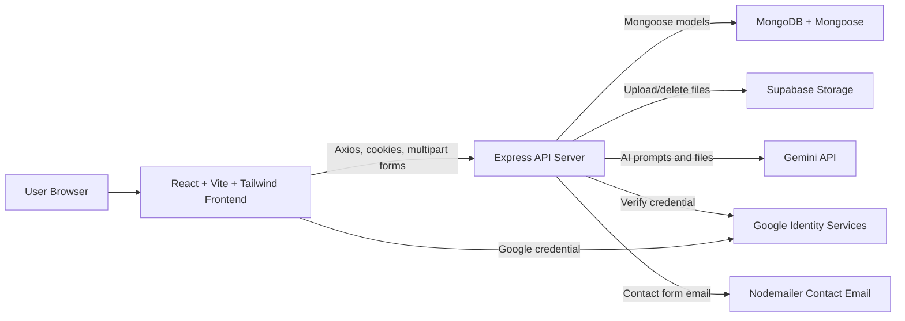

# GBPIET Notes

GBPIET Notes is a full-stack college community web application built for students, faculty, and admins of GBPIET. It combines academic resource sharing, Q&A discussions, community posts, user profiles, contribution tracking, moderation, and an AI study assistant into one connected platform.

The project has grown from a simple notes-sharing idea into a complete academic community system. Users can upload and browse notes, ask questions, answer doubts, follow contributors, like useful content, report inappropriate users, manage profile identity, track leaderboard activity, and use an AI chatbot for study help with text, PDFs, and images.

## Current Status

The project is functionally complete for a college project/demo version. The main product flows are implemented end-to-end:

- Email/password authentication.
- Google login and signup.
- Profile completion after signup.
- Responsive top navigation with mobile hamburger menu.
- Dashboard for authenticated users.
- Public logged-out landing page with backend-driven content.
- Notes/resources upload, listing, preview, detail, open, download, like, and comments.
- Q&A page with title, description, tags, multiple image uploads, answer expansion, answer upload, likes, and liked-user lists.
- Community page with text/image/multiple-image posts, comments, likes, liked-user lists, and user suggestions.
- User directory with follow/following actions.
- Student profile page with cover image, avatar, bio, tech stack, interests, links, stats, notes, Q&A, and posts.
- Settings page for account/profile management.
- Leaderboard and activity dashboard with weekly, monthly, and contribution graph views.
- AI chatbot page with streaming answers, history, new chat, clear chat, file upload, references, and simple vector-style retrieval.
- Moderation flow with report/undo report, report counts, and ban handling.
- Shared reusable UI pieces such as avatars, note cards, follow buttons, report buttons, modals, upload warnings, carousels, like actions, and profile links.

The remaining work is mostly production hardening, testing, admin review tooling, and final UI QA rather than missing core features.

## Project Goals

GBPIET Notes is designed to solve common academic collaboration problems:

- Notes are scattered across chats, drives, and personal devices.
- Useful study material is hard to discover.
- Students repeat the same doubts because answers are not centralized.
- Contributors do not get proper recognition.
- Community interaction is often disconnected from academic resources.
- Students need quick help for PDFs, handwritten material, typed notes, and conceptual doubts.

The platform addresses these through:

- A centralized resource library.
- Community Q&A.
- Social follow and profile systems.
- Contribution credits and leaderboard ranking.
- AI-powered study support.
- Reporting and account safety policies.

## Repository Structure

```text
GBPIET_NOTE/
  backend/
    src/
      app.js
      index.js
      constant.js
      controllers/
      db/
      middlewares/
      models/
      routes/
      utils/
    package.json
    package-lock.json
    Readme.md

  frontend/
    public/
    src/
      assets/
      components/
      constants/
      context/
      pages/
      services/
      utils/
      App.jsx
      index.css
      main.jsx
    package.json
    package-lock.json
    tailwind.config.js
    vite.config.js
    vercel.json
    README.md

  Readme.MD
```

## High-Level Architecture


```mermaid
flowchart LR
  User["User Browser"]
  Frontend["React + Vite + Tailwind Frontend"]
  Backend["Express API Server"]
  MongoDB["MongoDB + Mongoose"]
  Supabase["Supabase Storage"]
  Google["Google Identity Services"]
  Gemini["Gemini API"]
  SMTP["Nodemailer Contact Email"]

  User --> Frontend
  Frontend -->|"Axios, cookies, multipart forms"| Backend
  Backend -->|"Mongoose models"| MongoDB
  Backend -->|"Upload/delete files"| Supabase
  Frontend -->|"Google credential"| Google
  Backend -->|"Verify credential"| Google
  Backend -->|"AI prompts and files"| Gemini
  Backend -->|"Contact form email"| SMTP
```

## Tech Stack

### Frontend

- React `^19.2.0`
- React DOM `^19.2.0`
- React Router DOM `^7.10.1`
- Vite `^7.2.4`
- Tailwind CSS `^3.4.18`
- Axios `^1.13.4`
- Lucide React `^0.577.0`
- Framer Motion `^12.29.2`
- ESLint `^9.39.1`
- PostCSS `^8.5.6`
- Autoprefixer `^10.4.22`

### Backend

- Node.js with native ES modules
- Express `^5.1.0`
- MongoDB driver `^6.21.0`
- Mongoose `^8.19.2`
- JSON Web Tokens with `jsonwebtoken ^9.0.2`
- Password hashing with `bcrypt ^6.0.0`
- Cookie parsing with `cookie-parser ^1.4.7`
- CORS with `cors ^2.8.5`
- Environment variables with `dotenv ^17.2.3`
- File upload handling with `multer ^2.0.2`
- Supabase JS client `^2.76.1`
- Axios `^1.13.2`
- Nodemailer `^8.0.3`
- MIME detection with `mime-types ^3.0.1`
- Morgan `^1.10.1`
- Nodemon `^3.1.10`

### External Services

- MongoDB or MongoDB Atlas for application data.
- Supabase Storage for uploaded PDFs, images, avatars, and cover images.
- Google Cloud OAuth client for Google authentication.
- Gemini API for AI study assistant.
- Optional Gemini Google Search grounding.
- Mailboxlayer for real email validation during signup/contact flow.
- SMTP/Gmail through Nodemailer for contact form delivery.
- Vercel-ready frontend configuration.

## Frontend Routes

Routes are defined in `frontend/src/App.jsx`.

### Public/Auth Layout

```text
/login
/signup
/complete-profile
```

`/complete-profile` is protected and appears after signup/login if the user has not completed profile details.

### Main App Layout

```text
/
/notes
/notes/:noteId
/posts
/questions
/ai-chatbot
/leaderboard
/users
/profile/:username
/settings
/contact
/about
```

Most routes use `Layout`, which renders the sticky top header, profile dropdown, mobile menu, and footer. Login, signup, and complete-profile use `AuthLayout`.

## Backend Route Groups

The backend mounts all APIs under:

```text
/api/v1
```

Route groups:

```text
/api/v1/users
/api/v1/notes
/api/v1/upvotes
/api/v1/follows
/api/v1/questions
/api/v1/answers
/api/v1/posts
/api/v1/contact
/api/v1/activity
/api/v1/ai-chat
```

## Backend Application Files

- `backend/src/index.js`
  - Loads environment variables.
  - Connects to MongoDB.
  - Starts the server.

- `backend/src/app.js`
  - Configures Express.
  - Enables CORS and cookies.
  - Adds Google popup-compatible Cross-Origin-Opener-Policy.
  - Registers all route groups.
  - Registers centralized error handling.

- `backend/src/db/index.js`
  - Handles MongoDB connection.

- `backend/src/middlewares/error.middleware.js`
  - Central error handler.

- `backend/src/middlewares/auth.middleware.js`
  - Verifies JWT access token.

- `backend/src/middlewares/verifyJWTOptional.js`
  - Allows optional auth when an endpoint can work with or without login.

- `backend/src/middlewares/role.middleware.js`
  - Protects role-based routes.

- `backend/src/middlewares/multer.middleware.js`
  - Handles regular file uploads.

- `backend/src/middlewares/postUpload.middleware.js`
  - Handles community/Q&A image uploads.

- `backend/src/middlewares/aiUpload.middleware.js`
  - Handles AI chatbot uploads.

## Data Models

### User

File: `backend/src/models/user.model.js`

Fields:

- `username`
- `email`
- `googleId`
- `fullName`
- `password`
- `avatar`
- `coverImage`
- `role`
  - `student`
  - `faculty`
  - `admin`
- `branch`
- `year`
- `bio`
- `techStack`
- `interests`
- `profileLinks`
  - `github`
  - `linkedin`
  - `portfolio`
  - `instagram`
- `credits`
- `upvotes`
- `reportCount`
- `isBanned`
- `bannedAt`
- `refreshToken`
- `profileCompleted`
- timestamps

Behavior:

- Passwords are hashed before saving.
- Access tokens are generated from user instance methods.
- Refresh tokens are generated from user instance methods.
- Banned users are blocked from login.

### Note

File: `backend/src/models/note.model.js`

Fields:

- `title`
- `description`
- `fileUrl`
- `uploadedBy`
- `originalStudent`
- `upvotes`
- `comments`
- `verified`
- `subjectName`
- `subjectCode`
- `type`
  - `notes`
  - `pyqs`
  - `tuts`
  - `assignments`
- `tags`
- timestamps

### Question

File: `backend/src/models/question.model.js`

Fields:

- `title`
- `description`
- `imageUrl`
- `images`
- `subjectName`
- `subjectCode`
- `tags`
- `askedBy`
- `upvotes`
- `answers`
- timestamps

Questions support zero, one, or multiple images.

### Answer

File: `backend/src/models/answer.model.js`

Fields:

- `content`
- `imageUrl`
- `images`
- `answeredBy`
- `question`
- `upvotes`
- `comments`
- timestamps

Answers support text, images, or both.

### Post

File: `backend/src/models/post.model.js`

Fields:

- `text`
- `imageUrl`
- `images`
- `postedBy`
- `upvotes`
- `comments`
- timestamps

Posts support:

- text only
- image only
- text with image
- multiple images with carousel display

### Upvote

File: `backend/src/models/upvote.model.js`

The `Upvote` model supports likes/upvotes across:

- notes
- questions
- answers
- posts

Fields:

- `note`
- `question`
- `answer`
- `post`
- `upvotedBy`
- timestamps

### Follow

File: `backend/src/models/follow.model.js`

Fields:

- `follower`
- `following`
- timestamps

The model uses a unique compound index so the same user cannot follow another user twice.

### Report

File: `backend/src/models/report.model.js`

Fields:

- `reporter`
- `reportedUser`
- `reason`
- timestamps

The model uses a unique compound index on reporter and reported user. This allows one report per reporter per user and supports report toggling.

## Authentication

### Email/Password Signup

Endpoint:

```text
POST /api/v1/users/register
```

Frontend:

```text
frontend/src/pages/common/SignupPage.jsx
```

Flow:

1. User enters email and password.
2. Backend validates email format and real mailbox using the email validation utility.
3. Backend generates a unique username from the email.
4. User is created with incomplete profile.
5. JWT cookies are set.
6. User is redirected to complete profile.

### Login

Endpoint:

```text
POST /api/v1/users/login
```

Frontend:

```text
frontend/src/pages/common/LoginPage.jsx
```

Login supports:

- email + password
- username + password

Banned users are prevented from logging in.

### Google Login/Signup

Endpoint:

```text
POST /api/v1/users/google
```

Frontend:

```text
frontend/src/components/common/GoogleAuthButton.jsx
```

Flow:

1. Google Identity Services returns a credential to frontend.
2. Frontend sends credential to backend.
3. Backend verifies token with Google.
4. Backend checks that token audience matches `GOOGLE_CLIENT_ID`.
5. Existing user is logged in or a new Google user is created.
6. New Google users complete profile before entering main app.

### Complete Profile

Endpoint:

```text
PATCH /api/v1/users/complete-profile
```

Profile fields:

- full name
- username
- branch
- year
- role

Current allowed roles:

- student
- faculty
- admin

Admin appears only if no admin exists.

### Current User

Endpoint:

```text
GET /api/v1/users/current-user
```

Used by `AuthContext` to restore user session on app load.

### Logout

Endpoint:

```text
POST /api/v1/users/logout
```

Clears refresh token and auth cookies.

## Landing Page

File:

```text
frontend/src/pages/home/LandingPage.jsx
```

The landing page is shown when a user is not logged in. It has no sidebar and no authenticated navigation clutter.

Sections:

- Hero section.
- Backend-driven stat badges.
- Academic Titans / top contributors.
- High-Performance Notes / top study material.
- Smart Ecosystem features.
- Live Activity preview.
- Final call-to-action.
- Footer.

Backend data:

```text
GET /api/v1/users/landing
GET /api/v1/users/top-contributors
GET /api/v1/notes/top
GET /api/v1/activity/recent
```

Landing page behavior:

- If backend data exists, real project stats and user data are displayed.
- If avatars are missing, initials are used.
- Notes show view-only behavior for logged-out users.

## Dashboard

File:

```text
frontend/src/pages/home/Dashboard.jsx
```

Dashboard features:

- Personalized welcome.
- User stats.
- Weekly activity.
- Browse notes action.
- Ask question action.
- Browse people action.
- Study focus card.
- My courses/resources list.
- Latest updates feed.
- Community-style post cards.

The dashboard is responsive for mobile, tablet, and desktop.

## Notes / Resources

Frontend files:

```text
frontend/src/pages/notes/NotesPage.jsx
frontend/src/pages/notes/NoteDetailPage.jsx
frontend/src/components/notes/NoteCard.jsx
frontend/src/components/notes/NoteThumbnail.jsx
frontend/src/components/notes/NotePreview.jsx
frontend/src/components/notes/NoteHeader.jsx
frontend/src/components/notes/NoteComments.jsx
frontend/src/components/upload/UploadNote.jsx
frontend/src/utils/noteFileActions.js
```

Backend files:

```text
backend/src/routes/note.route.js
backend/src/controllers/note.controller.js
backend/src/models/note.model.js
```

Features:

- Notes page with search/filtering.
- Responsive note cards.
- Note thumbnail/preview display.
- Upload note form with labels and placeholders.
- Upload policy warning.
- Role-based upload visibility.
- Note detail page with structured professional UI.
- Embedded note preview.
- Like/upvote button.
- Liked users list.
- Open PDF button.
- Direct download button.
- Comments.
- User profile links from note usernames.
- Three-dot action menu.
- Owner can delete.
- Non-owner can report/undo report the uploader.

API:

```text
GET    /api/v1/notes
GET    /api/v1/notes/top
GET    /api/v1/notes/subject/:subjectCode
GET    /api/v1/notes/:noteId
POST   /api/v1/notes/upload
POST   /api/v1/notes/:noteId/comment
DELETE /api/v1/notes/:noteId
```

## Q&A

Frontend files:

```text
frontend/src/pages/qna/QuestionsPage.jsx
frontend/src/components/questions/QuestionCard.jsx
frontend/src/components/questions/QuestionsList.jsx
frontend/src/components/questions/QuestionsFilters.jsx
frontend/src/components/upload/UploadQuestion.jsx
```

Backend files:

```text
backend/src/routes/question.route.js
backend/src/controllers/question.controller.js
backend/src/models/question.model.js
backend/src/routes/answer.route.js
backend/src/controllers/answer.controller.js
backend/src/models/answer.model.js
```

Question features:

- Ask question form drops down inline.
- No blurred background for upload form.
- Required title.
- Required description.
- Required tags.
- Optional multiple image upload.
- Question cards in single-column feed layout.
- Tags displayed as bordered/animated chips.
- Dark readable question text.
- Like/upvote button.
- Liked-user list shown in modal with blurred background.
- Answer button expands answers on the same card.
- No separate question detail page.
- Three-dot card menu for edit/delete/report behavior.

Answer features:

- Text answer.
- Optional multiple answer images.
- Answer images displayed like post image carousel.
- Like/upvote button.
- Liked-user modal.
- Editable answers.
- Delete own answers.
- Report answer owner from action menu.

API:

```text
GET    /api/v1/questions
POST   /api/v1/questions/ask
GET    /api/v1/questions/:questionId
DELETE /api/v1/questions/:questionId

GET    /api/v1/answers/:questionId
POST   /api/v1/answers/:questionId
PATCH  /api/v1/answers/:answerId
POST   /api/v1/answers/:answerId/comment
DELETE /api/v1/answers/:answerId
```

## Community

Frontend files:

```text
frontend/src/pages/posts/PostsPage.jsx
frontend/src/components/posts/PostComposer.jsx
frontend/src/components/ui/AttachmentCarousel.jsx
```

Backend files:

```text
backend/src/routes/post.route.js
backend/src/controllers/post.controller.js
backend/src/models/post.model.js
```

Features:

- Modern community feed.
- Share post composer.
- Text-only posts.
- Single image posts.
- Multiple image posts.
- Image carousel with left/right controls.
- Black image background for clean viewing.
- Top padding around post images.
- Like/upvote button.
- Liked-user modal.
- Comment button.
- Previous comments list.
- Comment form.
- Edit own posts.
- Delete own posts through confirmation modal.
- Report/undo report post owner from three-dot menu.
- User suggestions on desktop.
- Suggestions hidden on mobile.
- See All button leads to `/users`.
- Mobile navbar includes user access.

API:

```text
GET    /api/v1/posts
POST   /api/v1/posts
POST   /api/v1/posts/:postId/comment
PATCH  /api/v1/posts/:postId
DELETE /api/v1/posts/:postId
```

## Likes / Upvotes

Frontend files:

```text
frontend/src/components/upvote/UpvoteButton.jsx
frontend/src/components/upvote/UpvotersList.jsx
frontend/src/components/ui/SocialLikeAction.jsx
frontend/src/components/ui/LikedUsersModal.jsx
```

Backend files:

```text
backend/src/routes/upvote.route.js
backend/src/controllers/upvote.controller.js
backend/src/models/upvote.model.js
backend/src/utils/getModelByType.js
```

Supported types:

- notes
- questions
- answers
- posts

Behavior:

- Like toggles on click.
- Icon reflects liked state.
- Count updates.
- Liked users can be viewed in a modal.
- Like UI is shared and styled consistently across notes, posts, and Q&A.

API:

```text
POST /api/v1/upvotes/:type/:id/toggle
GET  /api/v1/upvotes/:type/:id/count
GET  /api/v1/upvotes/:type/:id/users
```

## Follow System

Frontend files:

```text
frontend/src/components/ui/FollowButton.jsx
frontend/src/pages/user/UsersPage.jsx
frontend/src/pages/user/StudentProfilePage.jsx
```

Backend files:

```text
backend/src/routes/follow.route.js
backend/src/controllers/follow.controller.js
backend/src/models/follow.model.js
```

Features:

- Follow user.
- Unfollow user.
- Follow button changes style to Following state.
- Following button uses white background and blue text.
- Used consistently in:
  - user directory
  - profile page
  - followers modal
  - following modal
  - community suggestions

API:

```text
POST /api/v1/follows/toggle/:userId
GET  /api/v1/follows/:userId/followers
GET  /api/v1/follows/:userId/following
```

## User Directory

File:

```text
frontend/src/pages/user/UsersPage.jsx
```

Features:

- Single-column user list.
- Cards do not stretch too wide.
- Current user is hidden from the list.
- User cards show:
  - avatar
  - name
  - username
  - branch
  - year
  - follow/following button
- Filter button matches project color theme.

## Student Profile

Frontend file:

```text
frontend/src/pages/user/StudentProfilePage.jsx
```

Backend endpoint:

```text
GET /api/v1/users/profile/:username
```

Features:

- Cover image behind avatar.
- Avatar.
- Online status dot.
- Full name.
- Username.
- Email.
- Branch badge.
- Year badge.
- Follow/following button for other users.
- Report/undo report button for other users.
- Edit profile button for current user.
- Stats:
  - followers
  - following
  - upvotes
  - credits
  - reports
  - notes
  - questions
  - posts
- Followers modal.
- Following modal.
- Follow buttons inside connection modals.
- Bio section.
- Tech stack tags.
- Interests tags.
- Optional profile links:
  - GitHub
  - LinkedIn
  - Portfolio
  - Instagram
- Contribution tabs:
  - Notes
  - Q&A
  - Posts
- Note cards support preview, open, download, like, and detail navigation.
- Q&A cards summarize questions and answers.
- Post cards visually match community feed.

## Settings

Frontend file:

```text
frontend/src/pages/user/Settings.jsx
```

Backend endpoints:

```text
PATCH  /api/v1/users/update-account
POST   /api/v1/users/change-password
PATCH  /api/v1/users/avatar
PATCH  /api/v1/users/cover-image
DELETE /api/v1/users/cover-image
DELETE /api/v1/users/account
```

Features:

- Settings heading with simplified page intro.
- Profile preview with cover image behind avatar.
- Account overview.
- Public profile section.
- Bio edit.
- Tech stack edit.
- Interests edit.
- Profile links edit.
- Cover image upload.
- Cover image delete.
- Password/account sections.
- Delete account option.

Delete account behavior:

- Deletes the user account.
- Deletes owned notes, questions, answers, posts.
- Deletes user comments and upvotes.
- Deletes follow/follower records.
- Deletes reports by or against the user.
- Deletes related stored files where possible.
- Recalculates impacted reputation where needed.

## Report And Moderation System

Backend files:

```text
backend/src/models/report.model.js
backend/src/controllers/user.controller.js
backend/src/routes/user.route.js
```

Frontend files:

```text
frontend/src/components/ui/ReportUserButton.jsx
frontend/src/components/ui/CardActionMenu.jsx
```

Features:

- Report user.
- Undo report.
- Report button toggles based on current state.
- Report button appears:
  - on user profile
  - in note card action menu
  - in post card action menu
  - in Q&A card action menu
  - in answer action menu
- Report count is stored in user model.
- Report count is visible in profile stats.
- Two reports can ban an account.
- Undoing a report recalculates count and can unban if count falls below threshold.

API:

```text
POST /api/v1/users/:userId/report
GET  /api/v1/users/:userId/report-status
```

## Leaderboard And Activity Dashboard

Frontend file:

```text
frontend/src/pages/user/LeaderboardPage.jsx
```

Backend endpoint:

```text
GET /api/v1/users/leaderboard-dashboard
```

Features:

- Weekly activity card.
- Monthly tracker card.
- Contribution graph card shown only when user has contributions.
- Contribution graph uses project colors, not dark theme.
- Graph hover tooltip shows date and contribution count.
- Monthly calendar shows date numbers.
- Date boxes use visible blue styling.
- Leaderboard table.
- Rank, user, branch/year, score, contributions, likes.
- Top contributors visually highlighted.
- Pagination.
- Responsive mobile layout.

Activity sources:

- notes uploaded
- questions asked
- answers contributed
- posts shared

## AI Chatbot

Frontend file:

```text
frontend/src/pages/ai/AIChatbotPage.jsx
```

Backend files:

```text
backend/src/routes/aiChat.route.js
backend/src/controllers/aiChat.controller.js
backend/src/middlewares/aiUpload.middleware.js
backend/src/utils/aiVectorSearch.js
```

Features:

- Independent AI Chatbot page.
- Accessed from navbar.
- Not tied to individual note detail pages.
- Chatbox UI matches dashboard/community styling.
- Real-time streaming response text.
- Enter key sends message.
- Shift+Enter creates new line.
- New Chat button in chat header.
- History button in chat header.
- Clear Chat button in chat header.
- Chat history saved locally per user.
- Clicking a history chat loads that session.
- File upload support.
- Supported files:
  - PDF
  - images
  - handwritten notes as image/PDF
  - typed notes as PDF/image/text
  - plain text files
- User can ask direct doubts.
- Assistant can analyze uploaded files.
- Assistant can answer questions.
- Assistant can provide reference links when available.
- Simple retrieval over project notes/questions/posts.

API:

```text
GET  /api/v1/ai-chat/health
POST /api/v1/ai-chat/message
POST /api/v1/ai-chat/message/stream
```

AI environment variables:

```env
GEMINI_API_KEY=...
GEMINI_MODEL=gemini-2.5-flash
GEMINI_ENABLE_GOOGLE_SEARCH=true
```

Current AI approach:

- Gemini API handles generation.
- Streaming endpoint sends text chunks to frontend.
- Files are sent as inline data where supported.
- Local project context is retrieved through lightweight vector-style scoring.
- `aiVectorSearch.js` tokenizes and hashes text into vectors, then ranks with cosine similarity.

Future AI improvement:

- Use real embeddings.
- Store chunks in a vector database.
- Parse PDFs into text chunks.
- Persist chat history in MongoDB.
- Add source citation quality checks.
- Add user-level AI usage limits.

## Contact Page

Frontend file:

```text
frontend/src/pages/common/ContactUs.jsx
```

Backend files:

```text
backend/src/routes/contact.route.js
backend/src/controllers/contact.controller.js
backend/src/utils/sendEmail.js
```

Features:

- Styled contact form.
- Name, email, message.
- Email validation.
- Sends message through Nodemailer.

API:

```text
POST /api/v1/contact
```

Email variables:

```env
EMAIL_USER=...
EMAIL_PASS=...
MAILBOXLAYER_KEY=...
```

## About Page

Frontend file:

```text
frontend/src/pages/common/About.jsx
```

Features:

- Structured project overview.
- Styled to match the rest of the app.
- Accessible from profile dropdown.
- Explains product purpose and platform direction.

## Shared UI Components

Important reusable components:

```text
frontend/src/components/ui/UserAvatar.jsx
frontend/src/components/ui/UserProfileLink.jsx
frontend/src/components/ui/FollowButton.jsx
frontend/src/components/ui/ReportUserButton.jsx
frontend/src/components/ui/CardActionMenu.jsx
frontend/src/components/ui/ConfirmModal.jsx
frontend/src/components/ui/FormModal.jsx
frontend/src/components/ui/LikedUsersModal.jsx
frontend/src/components/ui/AttachmentCarousel.jsx
frontend/src/components/ui/SocialLikeAction.jsx
frontend/src/components/ui/UploadPolicyWarning.jsx
frontend/src/components/ui/LoadingButton.jsx
frontend/src/components/common/Loader.jsx
```

Design responsibilities:

- `UserAvatar`
  - Shows avatar image if available.
  - Falls back to initials if image is missing.

- `UserProfileLink`
  - Makes usernames clickable.
  - Navigates to `/profile/:username`.

- `FollowButton`
  - Shared follow/following button style.

- `ReportUserButton`
  - Shared report/undo report button.

- `CardActionMenu`
  - Three-dot menu for edit/delete/report actions.

- `ConfirmModal`
  - Replaces browser confirm for destructive actions.

- `LikedUsersModal`
  - Shows users who liked notes/posts/questions/answers.

- `AttachmentCarousel`
  - Displays multiple images for posts/questions/answers.

- `UploadPolicyWarning`
  - Warns users about inappropriate uploads and report-based bans.

## Toast And Alert System

Frontend context:

```text
frontend/src/context/ToastContext.jsx
```

Purpose:

- Replaces raw browser alerts.
- Shows popup messages at top-right.
- Used for success, error, and information feedback.

Future improvement:

- Replace any remaining legacy `alert()` usage with toast calls.
- Add consistent loading states to every form submission.

## Responsive Design

The project has been adjusted for:

- mobile screens
- tablet screens
- laptop screens
- desktop screens

Key responsive changes:

- Sidebar removed/replaced by top navigation.
- Mobile hamburger menu.
- Header width fixes to avoid horizontal scroll.
- Profile dropdown works from header avatar.
- Community user suggestions hidden on mobile.
- Main content stacks on mobile.
- Cards use single-column layouts where appropriate.
- Leaderboard/activity boxes shrink on smaller screens.
- Q&A and post cards avoid horizontal overflow.
- Forms appear inline or centered depending on page requirement.

Important design rules used:

- Soft blue/white page background.
- White cards.
- Indigo/blue primary accent.
- Rounded-xl and rounded-2xl cards.
- Subtle borders.
- Soft shadows.
- Clear typography hierarchy.
- No unnecessary horizontal scrolling on mobile.

## File Uploads

Storage service:

```text
Supabase Storage
```

Backend helper:

```text
backend/src/utils/supabaseStorage.js
```

Upload folders:

```text
notes
avatars
covers
questions
answers
posts
```

Upload use cases:

- note PDFs/documents
- note thumbnails/previews through PDF file URL
- post images
- question images
- answer images
- avatars
- cover images
- AI chatbot PDF/image/text files

## Environment Variables

### Backend `.env`

```env
PORT=8000
NODE_ENV=development
CORS_ORIGIN=http://localhost:5173

MONGODB_URI=...

ACCESS_TOKEN_SECRET=...
ACCESS_TOKEN_EXPIRY=...
REFRESH_TOKEN_SECRET=...
REFRESH_TOKEN_EXPIRY=...

GOOGLE_CLIENT_ID=...

SUPABASE_URL=...
SUPABASE_ANON_KEY=...

GEMINI_API_KEY=...
GEMINI_MODEL=gemini-2.5-flash
GEMINI_ENABLE_GOOGLE_SEARCH=true

EMAIL_USER=...
EMAIL_PASS=...
MAILBOXLAYER_KEY=...
```

Notes:

- `CORS_ORIGIN` must match the frontend URL exactly.
- `GOOGLE_CLIENT_ID` must match the OAuth Web Application client.
- `SUPABASE_URL` and `SUPABASE_ANON_KEY` are needed for uploads.
- `GEMINI_API_KEY` is needed for AI chatbot.
- `EMAIL_USER` and `EMAIL_PASS` are needed for contact form email.
- `.env` files must not be committed.

### Frontend `.env`

```env
VITE_API_BASE_URL=http://localhost:8000/api/v1
VITE_GOOGLE_CLIENT_ID=...
```

Google OAuth setup must include the frontend origin in Authorized JavaScript origins, for example:

```text
http://localhost:5173
https://your-deployed-frontend-url.vercel.app
```

## Local Setup

### Backend

```bash
cd backend
npm install
npm run dev
```

Default backend URL:

```text
http://localhost:8000
```

### Frontend

```bash
cd frontend
npm install
npm run dev
```

Default frontend URL:

```text
http://localhost:5173
```

## Build And Verification

### Frontend lint

```bash
cd frontend
npm run lint
```

### Frontend production build

```bash
cd frontend
npm run build
```

### Backend syntax check examples

```bash
node --check backend/src/controllers/user.controller.js
node --check backend/src/routes/user.route.js
```

## API Reference

### Users

```text
POST   /api/v1/users/register
POST   /api/v1/users/login
POST   /api/v1/users/google
GET    /api/v1/users/landing
GET    /api/v1/users/top-contributors
GET    /api/v1/users/profile-setup-options
PATCH  /api/v1/users/complete-profile
POST   /api/v1/users/logout
DELETE /api/v1/users/account
GET    /api/v1/users/current-user
GET    /api/v1/users/activity
GET    /api/v1/users/leaderboard-dashboard
GET    /api/v1/users/suggestions
GET    /api/v1/users/faculty
GET    /api/v1/users/students
GET    /api/v1/users/profile/:username
POST   /api/v1/users/change-password
PATCH  /api/v1/users/update-account
PATCH  /api/v1/users/avatar
PATCH  /api/v1/users/cover-image
DELETE /api/v1/users/cover-image
GET    /api/v1/users/:userId/report-status
POST   /api/v1/users/:userId/report
PATCH  /api/v1/users/update-role
```

### Notes

```text
GET    /api/v1/notes
GET    /api/v1/notes/top
GET    /api/v1/notes/subject/:subjectCode
GET    /api/v1/notes/:noteId
POST   /api/v1/notes/upload
POST   /api/v1/notes/:noteId/comment
DELETE /api/v1/notes/:noteId
```

### Questions

```text
GET    /api/v1/questions
POST   /api/v1/questions/ask
GET    /api/v1/questions/:questionId
DELETE /api/v1/questions/:questionId
```

### Answers

```text
GET    /api/v1/answers/:questionId
POST   /api/v1/answers/:questionId
PATCH  /api/v1/answers/:answerId
POST   /api/v1/answers/:answerId/comment
DELETE /api/v1/answers/:answerId
```

### Posts

```text
GET    /api/v1/posts
POST   /api/v1/posts
POST   /api/v1/posts/:postId/comment
PATCH  /api/v1/posts/:postId
DELETE /api/v1/posts/:postId
```

### Upvotes

```text
POST /api/v1/upvotes/:type/:id/toggle
GET  /api/v1/upvotes/:type/:id/count
GET  /api/v1/upvotes/:type/:id/users
```

### Follows

```text
POST /api/v1/follows/toggle/:userId
GET  /api/v1/follows/:userId/followers
GET  /api/v1/follows/:userId/following
```

### Activity

```text
GET /api/v1/activity/recent
```

### Contact

```text
POST /api/v1/contact
```

### AI Chat

```text
GET  /api/v1/ai-chat/health
POST /api/v1/ai-chat/message
POST /api/v1/ai-chat/message/stream
```

## Security And Safety

Implemented:

- Password hashing with bcrypt.
- JWT access and refresh tokens.
- HttpOnly auth cookies.
- CORS with credentials.
- Role middleware.
- Owner checks for edit/delete operations.
- Report and ban workflow.
- Upload policy warning.
- File type validation through upload middleware.
- Google credential verification.
- Email validation.

Still recommended:

- Add rate limiting.
- Add schema validation with Zod/Joi/Yup.
- Add stricter file size policies by feature.
- Add admin review UI for reports.
- Add audit logs.
- Add CSRF strategy if expanding cookie-based auth.
- Add centralized request validation.
- Add security headers through Helmet.
- Remove debug logs before production.

## Contribution And Reputation

The project tracks activity and reputation through:

- notes uploaded
- questions asked
- answers contributed
- posts shared
- likes/upvotes received
- credits
- followers/following
- leaderboard score

Backend helper:

```text
backend/src/utils/updateUserReputation.js
```

Leaderboard endpoint aggregates user-owned content and likes to rank contributors.

## Current Completion Matrix

| Area | Status | Notes |
| --- | --- | --- |
| Email/password auth | Complete | Works with JWT cookies |
| Google auth | Complete | Requires correct Google client setup |
| Profile completion | Complete | Student/faculty/admin options |
| Landing page | Complete | Uses backend data |
| Dashboard | Complete | Responsive and personalized |
| Notes/resources | Complete | Upload, preview, detail, open, download, like |
| Q&A | Complete | Questions, answers, tags, images, likes |
| Community | Complete | Posts, multiple images, comments, likes |
| User directory | Complete | Follow/following and current-user filtering |
| Profile page | Complete | Cover, avatar, stats, tabs, links |
| Settings | Complete for core account/profile flows | Can still receive UI polish |
| Follow system | Complete | Shared button |
| Report system | Complete | Report/undo report toggle |
| Leaderboard | Complete | Weekly/monthly/graph/table |
| AI chatbot | Complete simple mode | Advanced vector DB is future work |
| Contact page | Complete | Uses email utility |
| Responsive design | Mostly complete | Final manual QA still recommended |
| Tests | Not added | Future production hardening |
| Admin dashboard | Not added | Future scope |

## Future Scope

Important future upgrades:

1. Admin moderation dashboard.
   - View reported users.
   - Review reports.
   - Ban/unban manually.
   - Delete inappropriate content.

2. In-app notifications.
   - New answer notification.
   - New follower notification.
   - New comment notification.
   - Like notification.

3. Advanced AI chatbot.
   - Real document parsing.
   - Real embeddings.
   - Vector database.
   - Persistent chat history in MongoDB.
   - Better reference citations.
   - Per-user usage limits.

4. Testing.
   - Auth tests.
   - Upload tests.
   - Upvote tests.
   - Follow tests.
   - Report toggle tests.
   - Delete account cascade tests.

5. Production hardening.
   - Rate limiting.
   - Helmet.
   - Central validation.
   - Better logs.
   - Error monitoring.
   - Deployment health checks.

6. Better role approval.
   - Students should not self-assign faculty/admin in production.
   - Admin should approve elevated roles.

7. Saved/bookmarked notes.
   - Separate save model.
   - Personal saved library.
   - Offline-access planning.

8. More academic structure.
   - Branch-specific resources.
   - Semester filters.
   - Subject directory.
   - PYQ archive.
   - Verified faculty resources.

## Known Considerations

- Email notification to all users was discussed but intentionally not kept in the project.
- Gmail/SMTP bulk notification is not currently enabled.
- The contact form still uses Nodemailer for direct contact messages.
- AI references depend on available grounding and retrieved context.
- Browser support for Google Sign-In can show warnings in embedded web views.
- Production deployment requires exact CORS and OAuth origin setup.

## References

### Frontend

- React: https://react.dev/
- React Router: https://reactrouter.com/
- Vite: https://vite.dev/
- Tailwind CSS: https://tailwindcss.com/
- Axios: https://axios-http.com/
- Lucide Icons: https://lucide.dev/
- Framer Motion: https://www.framer.com/motion/

### Backend

- Node.js: https://nodejs.org/
- Express: https://expressjs.com/
- MongoDB: https://www.mongodb.com/docs/
- Mongoose: https://mongoosejs.com/
- JWT: https://jwt.io/
- bcrypt: https://www.npmjs.com/package/bcrypt
- Multer: https://github.com/expressjs/multer
- Nodemailer: https://nodemailer.com/

### Services

- Supabase Storage: https://supabase.com/docs/guides/storage
- Google Identity Services: https://developers.google.com/identity
- Google Cloud OAuth Credentials: https://console.cloud.google.com/apis/credentials
- Gemini API: https://ai.google.dev/
- Vercel: https://vercel.com/docs
- Mailboxlayer: https://mailboxlayer.com/

## Demo Talking Points

For a project presentation, the strongest points are:

- Full-stack MERN-style architecture.
- Role-aware academic resource sharing.
- Real file upload and cloud storage.
- Google OAuth integration.
- Social community features.
- Q&A with image-supported answers.
- Contribution-based leaderboard.
- AI chatbot with streaming responses.
- Responsive UI across mobile and desktop.
- Moderation/reporting workflow.
- Real-world extensibility through profiles, settings, and future admin tools.

## Summary

GBPIET Notes is a complete academic community platform for college students and faculty. It brings together notes, questions, answers, posts, user profiles, following, likes, moderation, leaderboard analytics, and AI study help in one consistent web application.

The project is ready for demo and project evaluation. The next stage would be production-level polish: testing, admin tooling, stronger validation, deployment monitoring, and advanced AI retrieval.
